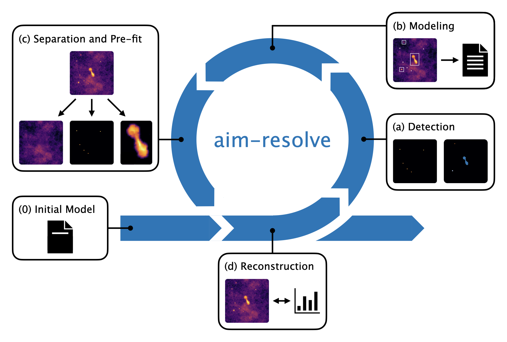

# aim-resolve

**Automatic Identification and Modeling for Bayesian Radio Interferometric Imaging**

This repository contains a [snakemake](https://snakemake.github.io) pipeline to automatically improve Bayesian imaging of complex systems like radio interferometric wide-field observations. It combines [NIFTy](http://ift.pages.mpcdf.de/nifty/) and [resolve](http://ift.pages.mpcdf.de/resolve/) with deep learning and clustering algorithms for object recognition and separation, respectively. More specifically, it utilizes different model descriptions for different types of identified objects to improve the overall reconstruction of radio interferometric data.



Initialized with a single background model capturing the whole field of view in step (0), the method produces a preliminary reconstruction of the data in step (d). Then, it iterates over the following steps:

- **(a) Identification**: By combining a [U-Net](https://arxiv.org/abs/1505.04597) trained on synthetic images and a clustering algorithm like [DBSCAN](https://scikit-learn.org/stable/modules/clustering.html#dbscan), point sources and extended objects are identified in the reconstruction.

- **(b) Modeling**: This step creates a model configuration file for the subsequent reconstruction iteration by adding the new components to the background model.

- **(c) Separation and Pre-fit**: The new model is first fitted to the previous reconstructed image. By masking the background, this step efficiently separates the point sources and extended objects from the background.

- **(d) Reconstruction**: The pre-fitted model is further optimized on the data. The individual components can be added together to compose a full sky image, allowing for object detection in the next iteration.


These individual steps are implemented as rules in the [snakefile](steering/snakefile) by building output files from input files using specific python scripts.


## Installation

Clone the repository and install aim-resolve via
```
git clone https://github.com/rifu4/aim-resolve.git
cd aim-resolve
pip install .
```

To apply the method to radio interferometric data, [resolve](http://ift.pages.mpcdf.de/resolve/) needs to be installed via
```
git clone --recursive https://gitlab.mpcdf.mpg.de/ift/resolve
cd resolve
pip install .
```

To use multi-frequency models, [UBIK](https://github.com/NIFTy-PPL/J-UBIK) needs to be installed via
```
git clone https://github.com/NIFTy-PPL/J-UBIK
cd j-ubik
pip install .
```


## Steering

### Run the snakemake pipeline

There are 3 different modes the pipeline can be used with:

- `image`: lognormal model and image data (unit response)

- `radio`: lognormal model and radio interferometric data (radio response)

- `fast`: same as radio, but using the fast-resolve algorithm for inference

The mode needs to be specified at the beginning of the snakemake [config](steering/config/snake.yml) file along with the output directory, the jax random key and the total number of pipelne iterations. Moreover, the config file sets the resolution and field of view of the background model as well as the to be reconstructed data, and various other modeling and optimization parameters.

To run the snakemake pipeline, change directory to the `steering` folder and run
```
snakemake --cores 1
```
Moreover, it is possible to specify a different configuration file and to run on a GPU via 
```
snakemake --cores 1 --config file=<cfg-file> --cuda_device=0
```


### Extend aim-resolve results

After the end of an aim-resolve pipeline run, it possible to extend the final multi-component model e.g. to multiple frequencies or to increase the resolution of the detected components. To do so, use a extension config file (e.g. the [zoom](steering/nifty/config/zoom_ext.yml) extension file) to specify the desired extension mode (`freq` or `zoom`) and parameters, the output directory of the pipeline run, and the model configuration file to start from. Inside the `steering` folder run
```
python3 nifty/extend_rec.py --config <ext-file> --cuda_device 0
```


### Optimize multi-component models using NIFTy

In general, it is possible to run a NIFTy optimization with a pre-defined multi-component model. Tod do so, specify the model and optimization parameters in the desired NIFTy config file (e.g. the [CygnusA](steering/nifty/config/cyg.yml) config file). Inside the `steering` folder run
```
python3 nifty/nifty_rec.py --config <cfg-file> --cuda_device 0
```


### Generate image data

To generate image data, specify the desired data parameters in the data [config](steering/data/config/data.yml) file. Inside the `steering` folder run
```
python3 data/data_gen.py --config <data-file>
```


### Train the U-Net on image data

To train the U-Net on generated image data, specify the desired data and training parameters in the train [config](steering/train/config/unet.yml) file. Inside the `steering` folder run
```
python3 train/train_model.py --config <train-file>
```


## References

The method is further explained in the [aim-resolve](https://arxiv.org/abs/2512.04840) paper.
